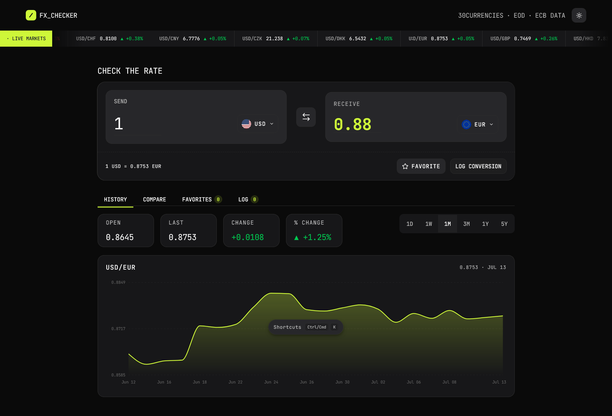
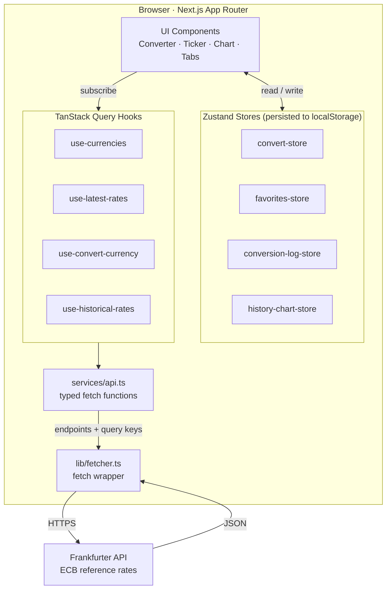

<p align="center">
  
</p>

<h1 align="center">FX Currency Checker</h1>

<p align="center">
  A monospace, keyboard-driven currency converter with live markets, historical charts, comparisons, favorites and an exportable conversion log — backed by the European Central Bank via the Frankfurter API.
</p>

<p align="center">
  <a href="https://fx-currency-converter.vercel.app/"><b>▶ Live Demo</b></a>
  &nbsp;·&nbsp;
  <a href="#-features">Features</a>
  &nbsp;·&nbsp;
  <a href="#-tech-stack">Tech Stack</a>
  &nbsp;·&nbsp;
  <a href="#-architecture">Architecture</a>
</p>

<p align="center">
  
  
  
  
  
</p>

---

## 🎬 Demo

**Live site:** [fx-currency-converter.vercel.app](https://fx-currency-converter.vercel.app/)

## 📸 Preview

<p align="center">
  
</p>

## 📖 About

**FX Currency Checker** is a [Frontend Mentor](https://www.frontendmentor.io/) challenge built as a portfolio-quality single-page app. It converts between currencies using real, ECB-published exchange rates and layers on the tooling you'd actually want in a rates dashboard: a scrolling live-markets ticker, an interactive historical chart, side-by-side multi-currency comparison, pinnable favorite pairs, and a persistent conversion log you can export to CSV or JSON.

All exchange-rate data comes from the free, key-less [**Frankfurter API**](https://frankfurter.dev/), which tracks reference rates from the **European Central Bank**. UI state (amount, selected pair, favorites, log, chart range) is persisted to `localStorage`, so a session survives a page refresh.

The design is deliberately **monospace-only** — a single JetBrains Mono family drives the entire type system — with a lime-green accent and full light / dark / system theming.

## ✨ Features

| Area | What it does |
|---|---|
| **Live converter** | Convert an amount between currencies, with the effective `1 base = x symbol` rate shown beneath. The amount input is sanitized to digits plus a single decimal point. |
| **Currency picker** | Searchable combobox with country flags, grouped into *Popular* and *Other currencies*, fully keyboard-navigable. |
| **Swap** | One click (or `Shift + S`) flips the send/receive pair. |
| **Live Markets ticker** | An infinite, blur-masked marquee of USD pairs showing each live rate and its day-over-day change (▲/▼ %), derived from a single latest-rates poll plus one historical window. |
| **History chart** | Interactive Recharts area chart with a crosshair and tooltip across **1D / 1W / 1M / 3M / 1Y / 5Y** timeframes, plus summary conversion stats (open, last, change, % change). |
| **Compare** | Multi-currency panel converting the amount against a curated set of major currencies at once, each with its reference rate. |
| **Favorites** | Pin any pair; each pinned row shows its current rate and daily change. Persisted across sessions. |
| **Conversion log** | Save conversions to a running log, delete individual entries or clear all, and **export to CSV or JSON** — entirely client-side, no server. |
| **Keyboard shortcuts** | `Ctrl/Cmd + K` opens a shortcuts dialog; single-key shortcuts drive theme, swap, focus, picker navigation and chart ranges — while never hijacking keys mid-typing. |
| **Theming** | Light / dark / system themes via `next-themes`, with all colors driven by OKLCH design tokens. |
| **Polish** | Skeleton loaders for every async surface, responsive layout (the tab strip collapses into a dropdown on mobile), and semantic-token styling throughout. |

## 🧰 Tech Stack

| Category | Technology |
|---|---|
| **Framework** | [Next.js 16](https://nextjs.org/) (App Router, React Server Components) |
| **UI library** | [React 19](https://react.dev/) |
| **Language** | [TypeScript 5](https://www.typescriptlang.org/) |
| **Styling** | [Tailwind CSS v4](https://tailwindcss.com/) (CSS-first config, no `tailwind.config.js`) |
| **Components** | [shadcn/ui](https://ui.shadcn.com/) (`radix-nova` style) on [Radix UI](https://www.radix-ui.com/) + [Base UI](https://base-ui.com/) |
| **Data fetching** | [TanStack Query v5](https://tanstack.com/query) |
| **State** | [Zustand v5](https://zustand-demo.pmnd.rs/) with `persist` middleware (localStorage) |
| **Charts** | [Recharts](https://recharts.org/) |
| **Animation** | [Motion](https://motion.dev/) + motion-primitives (infinite slider, progressive blur) |
| **Icons** | [lucide-react](https://lucide.dev/) |
| **Theming** | [next-themes](https://github.com/pacocoursey/next-themes) |
| **Font** | [JetBrains Mono](https://www.jetbrains.com/lp/mono/) (monospace-only design) |
| **Data source** | [Frankfurter API](https://frankfurter.dev/) — ECB reference rates |
| **Tooling** | ESLint · Prettier (`prettier-plugin-tailwindcss`) · pnpm |

## 🏗 Architecture

The app is organized in clean layers: **UI components** read and write global UI state through **Zustand stores** and request server data via **TanStack Query hooks**. Those hooks call typed **service functions**, which build request URLs from centralized **endpoints** and go over a thin **`fetcher`** wrapper to the Frankfurter API. Query keys are centralized so cache reads and writes never drift.



**Key decisions**

- **RSC-first:** Server Components by default; `"use client"` is added only where state, handlers, or browser APIs are needed.
- **Single fetch surface:** every request flows through `lib/fetcher.ts`, so error handling and the base URL live in one place.
- **Cache correctness:** the converter and the "Log conversion" action share a query key, so logging reuses the cached rate instead of re-fetching.
- **Derived, not duplicated:** day-over-day change in the ticker and favorites is computed from historical windows rather than one request per pair.

## 📁 Folder Structure

```text
FX-currency-converter/
├── app/            # App Router entry — layout, page, globals.css, typography.css
├── components/     # Feature components + shadcn/ui primitives (ui/)
├── hooks/          # TanStack Query hooks (currencies, rates, convert, history)
├── lib/            # Utilities — fetcher, query client/keys, format, date helpers
├── services/       # API fetch functions (api.ts) and endpoints (endpoints.ts)
├── store/          # Zustand stores (converter, favorites, log, chart range)
├── providers/      # QueryProvider, ThemeProvider
├── types/          # Shared TypeScript types
└── public/         # Static assets — currency flags + JetBrains Mono font
```

## 🚀 Installation

**Prerequisites:** [Node.js](https://nodejs.org/) 18+ and [pnpm](https://pnpm.io/). No API key is required — the Frankfurter API is free and key-less.

```bash
# 1. Clone the repository
git clone https://github.com/Joseph-Abdullaah/FX-currency-converter.git
cd FX-currency-converter

# 2. Install dependencies
pnpm install

# 3. Start the dev server
pnpm dev
```

Open [http://localhost:3000](http://localhost:3000) in your browser.

**Available scripts**

```bash
pnpm dev          # Start the development server
pnpm build        # Create a production build
pnpm start        # Serve the production build
pnpm lint         # Run ESLint
pnpm format       # Format with Prettier
pnpm typecheck    # Type-check with tsc --noEmit
```

## 🔮 Future Improvements

- Add automated tests (unit + component) around the rate/date math and the keyboard-shortcut handler.
- Surface API/network errors with retry affordances instead of inline fallback text.
- Persist and share converter state via URL params (deep-linkable pairs).
- Cache the ECB data server-side and hydrate it to skip the initial client fetch.
- Broaden currency coverage or add a secondary rates provider as a fallback.
- Accessibility pass (screen-reader announcements for live rate updates, reduced-motion ticker).

## 🙏 Credits

- **Challenge:** [Frontend Mentor](https://www.frontendmentor.io/) — FX Checker.
- **Exchange-rate data:** [Frankfurter API](https://frankfurter.dev/), sourcing [European Central Bank](https://www.ecb.europa.eu/) reference rates.
- **UI components:** [shadcn/ui](https://ui.shadcn.com/), [Radix UI](https://www.radix-ui.com/), [Base UI](https://base-ui.com/).
- **Icons:** [lucide-react](https://lucide.dev/) · **Font:** [JetBrains Mono](https://www.jetbrains.com/lp/mono/).
- **Built by** [Joseph Abdullaahi](https://github.com/Joseph-Abdullaah).

## 📄 License

Licensed under the **MIT License** — free to use, modify, and distribute.
