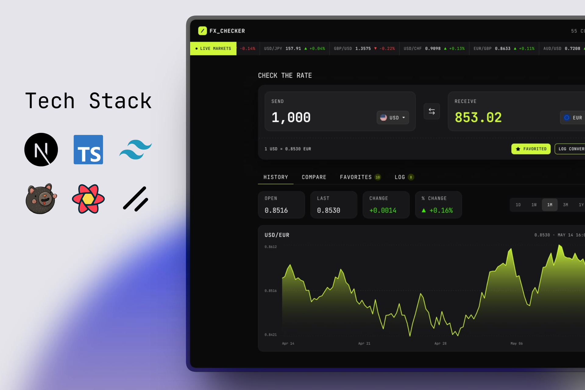

# Frontend Mentor - FX Checker solution

This is a solution to the [FX Checker challenge on Frontend Mentor](https://www.frontendmentor.io/challenges/foreign-exchange-currency-converter). Frontend Mentor challenges help you improve your coding skills by building realistic projects.



## Table of contents

- [Overview](#overview)
  - [The challenge](#the-challenge)
  - [Screenshot](#screenshot)
  - [Links](#links)
- [My process](#my-process)
  - [Built with](#built-with)
  - [What I learned](#what-i-learned)
  - [Continued development](#continued-development)
  - [Useful resources](#useful-resources)
  - [AI Collaboration](#ai-collaboration)
- [Author](#author)
- [Acknowledgments](#acknowledgments)

## Overview

### The challenge

FX Checker is a currency-conversion UI backed by live European Central Bank
reference rates (via the [Frankfurter](https://frankfurter.dev) API). Users should be able to:

#### Converter

- Enter an amount to send and see it convert in real time as they type
- Pick the "send" and "receive" currencies from a searchable currency picker
- See the live exchange rate for the active pair (for example, `1 USD = 0.8530 EUR`)
- Swap the send and receive currencies with the swap button
- Favorite the active pair, and log a conversion to their history

#### Currency picker

- Search the full list of available currencies by code or name
- See currencies grouped into "Popular" and "Other currencies", each row showing the flag, code, and name
- See a check against the currency that's currently selected

#### Live markets ticker

- See a ticker of currency pairs, each with its current rate and day-over-day change (up or down)

#### Rate history

- View a line and area chart of the active pair's rate over time
- Switch the chart range between 1D, 1W, 1M, 3M, 1Y, and 5Y
- See the open, last, absolute change, and percentage change for the selected range

#### Compare

- See their send amount converted into a range of other currencies at once, each with its reference rate
- Pin or unpin any comparison row to their favorites

#### Favorites

- See their pinned pairs, each with its live rate and day-over-day change
- Load a pinned pair back into the converter by selecting its row
- Unpin a pair they no longer want to track

#### Conversion log

- See a log of conversions they've made, each showing the relative time, the pair, and the send and receive amounts
- Clear the whole log
- Delete an individual entry

#### UI & accessibility

- View the optimal layout for the interface depending on their device's screen size
- See hover, focus, and cursor states for all interactive elements on the page
- Toggle between light and dark themes
- Navigate the entire app using only their keyboard

### Screenshot

<!-- Add your screenshot here, e.g.  -->

_Screenshot coming soon._

### Links

- Solution URL: [github.com/Joseph-Abdullaah/FX-currency-converter](https://github.com/Joseph-Abdullaah/FX-currency-converter)
- Live Site URL: _Add your deployed URL here (e.g. Vercel)_

## My process

### Built with

- [Next.js 16](https://nextjs.org/) (App Router, React Server Components) — React framework
- [React 19](https://react.dev/) + [TypeScript](https://www.typescriptlang.org/)
- [Tailwind CSS v4](https://tailwindcss.com/) — CSS-first config (theme in `app/globals.css`), no `tailwind.config.js`
- [shadcn/ui](https://ui.shadcn.com/) (`radix-nova` style) on [Radix UI](https://www.radix-ui.com/) primitives
- [TanStack Query v5](https://tanstack.com/query) — data fetching, caching, and background refetching
- [Zustand v5](https://zustand-demo.pmnd.rs/) — client state, persisted to `localStorage`
- [Recharts v3](https://recharts.org/) — rate-history chart
- [Motion](https://motion.dev/) — live-markets ticker animation
- [next-themes](https://github.com/pacocoursey/next-themes) — light/dark theming
- [lucide-react](https://lucide.dev/) — icons
- [Frankfurter API](https://frankfurter.dev) — ECB reference exchange-rate data
- JetBrains Mono — monospace-only type system
- Mobile-first, responsive layout with semantic HTML, Flexbox, and CSS Grid

### What I learned

**Deriving day-over-day change for the whole ticker in a single request.** The
live-markets ticker needs a current rate _and_ a percentage change for every
pair. A single "latest" snapshot can't produce a change, and fetching history
per pair would fire ~30 requests. Instead, the current rates come from one
`latest` call and the previous close comes from **one all-symbols historical
window**, so the change is computed for every pair without a request per pair:

```tsx
// Prior close = the most recent published day strictly before the latest one.
const previousRates =
  latest?.date && history?.rates
    ? history.rates[
        Object.keys(history.rates)
          .sort()
          .reverse()
          .find((date) => date < latest.date) ?? ""
      ]
    : undefined
```

**Server vs. client boundaries.** Pages stay as Server Components while only the
pieces that need hooks or browser state opt into `"use client"`. The header, for
example, is a client component purely so it can read the live currency count
from a TanStack Query hook, while the page around it renders on the server.

**Theme-invariant active states.** The design tokens for the lime brand accent
(`--primary`) and its foreground (`--primary-foreground`) are identical in light
and dark mode. Leaning on those tokens — instead of translucent hover states
that blend with the surface behind them — keeps the "favorited" button rendering
exactly the same in both themes:

```tsx
favorited &&
  "border-primary bg-primary text-primary-foreground hover:bg-[color-mix(in_oklch,var(--primary),var(--primary-foreground)_12%)]"
```

**Persisted client state with Zustand.** Converter inputs, favorites, the
conversion log, and the chart range each live in a small persisted store, so a
user's session survives a page reload.

### Continued development

- Deploy a live version and wire up the solution + live-site links
- Add unit tests around the rate/change math and store logic
- Cache the ECB data server-side and hydrate it to avoid the initial client fetch
- Expand keyboard-navigation and screen-reader testing across every panel

### Useful resources

- [Frankfurter API docs](https://frankfurter.dev) - Free, ECB-backed exchange-rate API used for every rate in the app.
- [TanStack Query docs](https://tanstack.com/query/latest/docs/framework/react/overview) - For query keys, background refetching, and caching patterns.
- [Zustand docs](https://zustand.docs.pmnd.rs/) - For the small, persisted stores.
- [shadcn/ui](https://ui.shadcn.com/docs) - Composition, theming, and the component primitives.
- [Next.js Server & Client Components](https://nextjs.org/docs/app/building-your-application/rendering) - For deciding where the `"use client"` boundary belongs.

### AI Collaboration

I used [Claude Code](https://claude.com/claude-code) as a pair-programming
assistant during this build.

- **Tool:** Claude Code (Anthropic).
- **How I used it:** wiring UI components to the API and Zustand stores,
  refactoring the live-markets ticker and compare panel to be fully data-driven,
  normalizing hover/focus/cursor states across every interactive element, and
  documenting the project.
- **What worked well:** quickly reasoning about data-fetching trade-offs (e.g.
  avoiding one request per pair) and keeping styling consistent with the existing
  design tokens. I reviewed and directed the changes, kept design decisions my
  own, and verified behavior against the live API and a running dev server.

## Author

- Frontend Mentor - [@Joseph-Abdullaah](https://www.frontendmentor.io/profile/Joseph-Abdullaah)
- GitHub - [@Joseph-Abdullaah](https://github.com/Joseph-Abdullaah)

## Acknowledgments

- [Frontend Mentor](https://www.frontendmentor.io/) for the challenge design and brief.
- [Frankfurter](https://frankfurter.dev) and the European Central Bank for the free exchange-rate data.
